<div align="center">

<p align="center">
    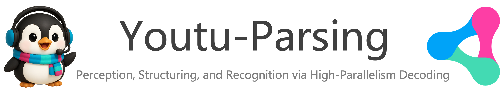
</p>

<h1 align="center"></h1>


<!-- Quick Links -->
<p align="center">
    <a href="LICENSE"><b>📄 License</b></a> •
    <a href="https://huggingface.co/spaces/Tencent/Youtu-Parsing"><b>🖥️ Demo</b></a> •
    <a href="#quick-start"><b>🚀 Quick Start</b></a> •
    <a href="#performance"><b>📊 Performance</b></a> •
    <!-- <a href="#-citation"><b>📄 Technical Report</b></a> • -->
    <a href="https://huggingface.co/collections/tencent/youtu"><b>🤗 Models</b></a> •
    <a href="#citation"><b>📚 Citation</b></a>
</p>

</div>

<div align="center">
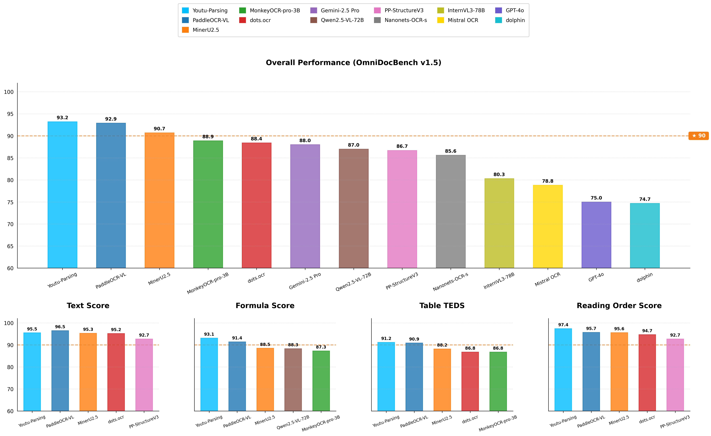
</div>

## 🎯 Introduction

**Youtu-Parsing** is a specialized document parsing model built upon the open-source Youtu-LLM 2B foundation. By extending the capabilities of the base model with a prompt-guided framework and NaViT-style dynamic visual encoder, Youtu-Parsing offers enhanced parsing capabilities for diverse document elements including text, tables, formulas, and charts. The model incorporates an efficient parallel decoding mechanism that significantly accelerates inference, making it practical for real-world document analysis applications. We share Youtu-Parsing with the community to facilitate research and development in document understanding.

---

## ✨ Key Features

### 📄 **Document Structure Preservation**
- **Text Localization**: Accurately detects and localizes text regions with pixel-level precision, ensuring no content is missed or misplaced across diverse document layouts.
- **Reading Order Restoration**: Intelligently reconstructs the logical reading sequence of document content, maintaining proper flow across columns, sections, and pages for coherent understanding.

### 🔍 **Advanced Content Recognition**
- **Text Recognition**: Provides precise text recognition across diverse scenarios.
- **Formula Recognition**: Automatically converts mathematical expressions to LaTeX format.
- **Table Recognition**: Automatically detects tables and converts them to HTML format.
- **Chart Recognition**: Converts charts to markdown tables, mind maps and flow charts to mermaid format.

### ⚡ **High-Performance Inference**
- **Token Parallelism**: Enables simultaneous inference of multiple tokens for accelerated processing, achieving 5-11x speedup.
- **Query Parallelism**: Combines multiple queries together to maximize Token Parallelism benefits, providing an additional 2x speedup on top of Token Parallelism acceleration.

<div align="center">
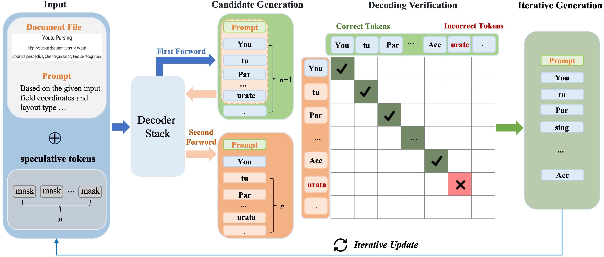
</div>

---

<a id="quick-start"></a>

## 🚀 Quick Start

The following guide demonstrates how to use Youtu-Parsing with Hugging Face integration for local deployment.

### 📦 Installation

**Option 1: Install from Git Repository**
```bash
conda create -n youtu_parsing python=3.10 
conda activate youtu_parsing
pip install git+https://github.com/TencentCloudADP/youtu-parsing.git#subdirectory=youtu_hf_parser
```

**Option 2: Local Development Installation**
```bash
git clone https://github.com/TencentCloudADP/youtu-parsing.git
cd youtu-parsing/youtu_hf_parser
pip install -e .
```

### ⚡ Flash Attention Setup

Flash Attention is **required** for optimal performance. Choose the installation method that works best for your environment:

```bash
# 🎯 For CUDA 12.x + PyTorch 2.6 + Python 3.10 + Linux x86_64:
pip install https://github.com/Dao-AILab/flash-attention/releases/download/v2.7.4.post1/flash_attn-2.7.4.post1+cu12torch2.6cxx11abiFALSE-cp310-cp310-linux_x86_64.whl

# 🔄 Alternative: Install from PyPI (may require compilation)
pip install flash-attn>=2.7.0
```

> **💡 Note**: Flash Attention installation is platform-specific. If you encounter issues, please refer to the [official installation guide](https://github.com/Dao-AILab/flash-attention).

<a id="model-download"></a>

### 📥 Model Weights Download

Download the pre-trained model weights from our official repository:

🔗 **[Youtu-Parsing Model Hub](https://huggingface.co/collections/tencent/youtu)**

### 💻 Usage Example

```python
from youtu_hf_parser import YoutuOCRParserHF

# Initialize the parser with model configuration
parser = YoutuOCRParserHF(
    model_path=model_path,                    # Path to downloaded model weights
    enable_angle_correct=True,                # Set to False to disable angle correction
    angle_correct_model_path=angle_correct_model_path  # Path to angle correction model
)

# Parse a document (supports images, PDFs, and more)
parser.parse_file(
    input_path=image_path,     # Input document path
    output_dir=output_dir      # Output directory for results
)

print("✅ Document parsing completed!")
print(f"📄 Results saved to: {output_dir}")
```

---

<a id="performance"></a>

## 📊 Performance

Our comprehensive evaluation demonstrates Youtu-Parsing's superior performance across multiple benchmarks and real-world scenarios.

### OminiDocBench v1.5 Benchmark

<div align="center">
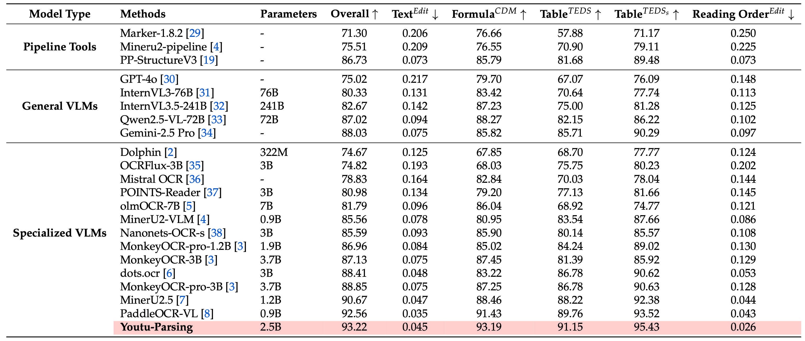
</div>

### olmOCR Benchmark

<div align="center">
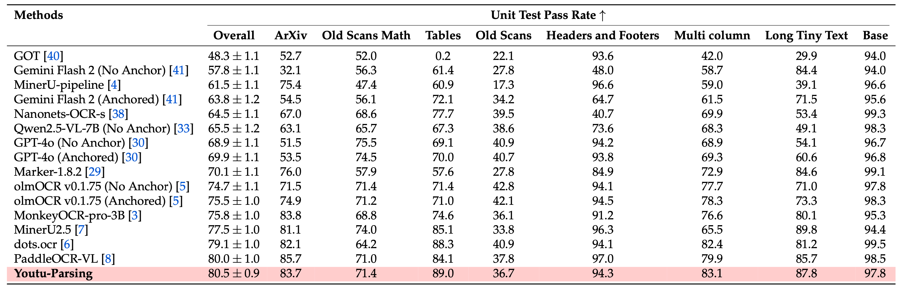
</div>

## 🎨 Visualization & Examples

### Text Recognition
<div align="center">
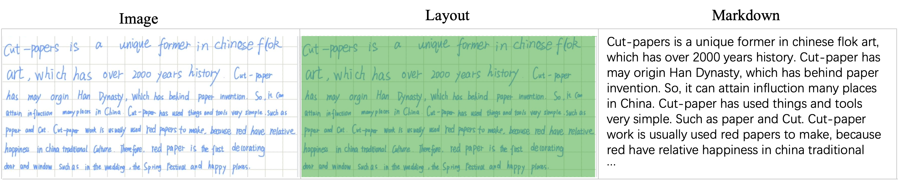
</div>

<div align="center">
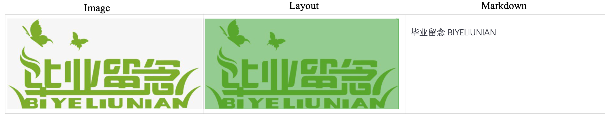
</div>

<div align="center">
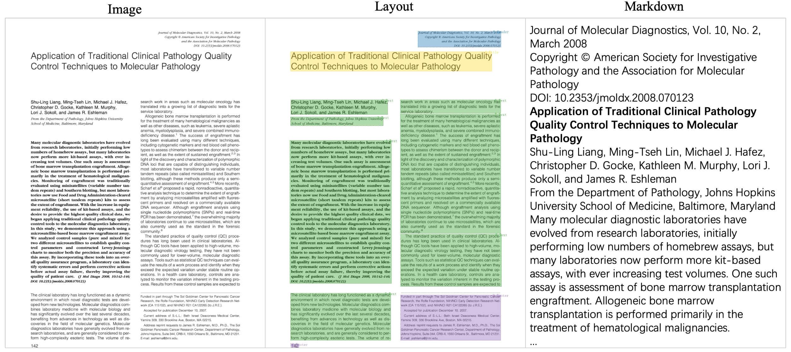
</div>

### Formula & Mathematical Expression
<div align="center">
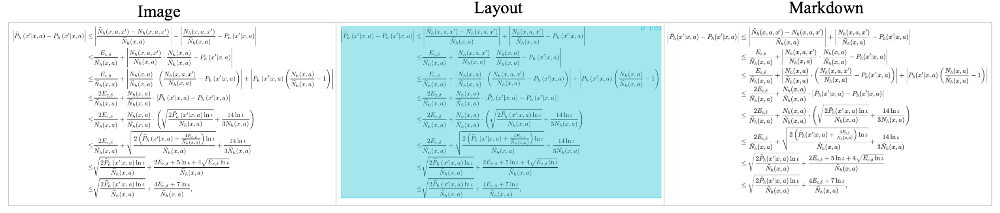
</div>

### Table Recognition
<div align="center">
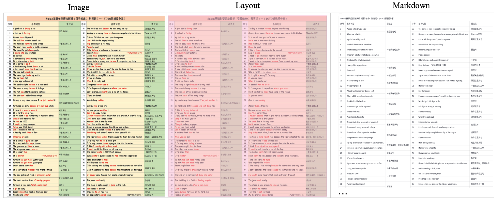
</div>

<div align="center">
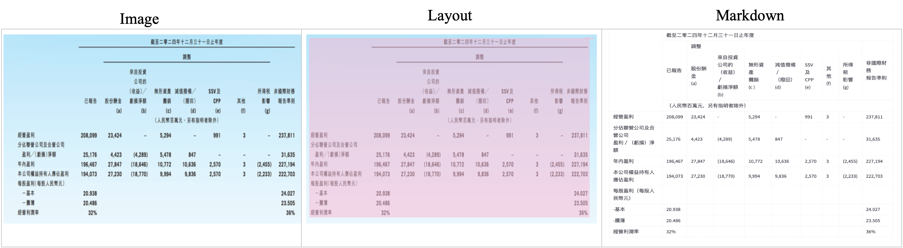
</div>

### Chart Recognition
<div align="center">
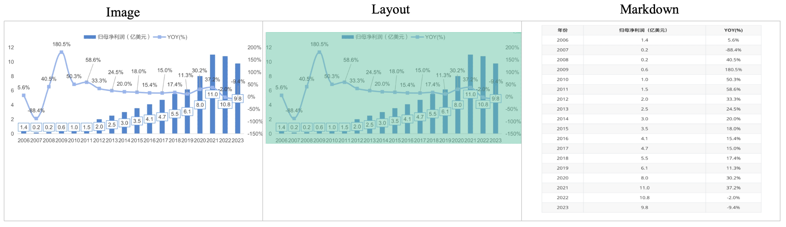
</div>

<div align="center">
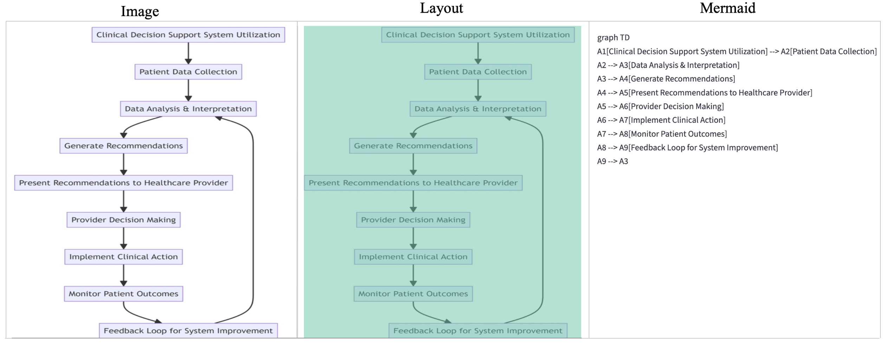
</div>

---

## 🤝 Acknowledgments

We extend our gratitude to the following projects and communities that made Youtu-Parsing possible:

- [Youtu-LLM](https://github.com/TencentCloudADP/youtu-tip/tree/master/youtu-llm)
- [PDF-Extract-Kit](https://github.com/opendatalab/PDF-Extract-Kit)
- [PaddleOCR](https://github.com/PaddlePaddle/PaddleOCR)
- [MinerU](https://github.com/opendatalab/MinerU)
- [dots.ocr](https://github.com/rednote-hilab/dots.ocr)
- [PSENet](https://github.com/whai362/PSENet)

---

<a id="citation"></a>

## 📚 Citation

If you find Youtu-Parsing useful in your research or applications, please consider citing our work:

```bibtex
@article{youtu-parsing,
  title={Youtu-Parsing: Perception, Structuring and Recognition via High-Parallelism Decoding},
  author={Tencent Youtu Lab},
  year={2026},
  eprint={},
  archivePrefix={},
  primaryClass={},
  url={}, 
}

@article{youtu-vl,
  title={Youtu-VL: Unleashing Visual Potential via Unified Vision-Language Supervision},
  author={Tencent Youtu Lab},
  year={2026},
  eprint={},
  archivePrefix={},
  primaryClass={},
  url={}, 
}

@article{youtu-llm,
  title={Youtu-LLM: Unlocking the Native Agentic Potential for Lightweight Large Language Models},
  author={Tencent Youtu Lab},
  year={2025},
  eprint={2512.24618},
  archivePrefix={arXiv},
  primaryClass={cs.CL},
  url={https://arxiv.org/abs/2512.24618}, 
}
```
